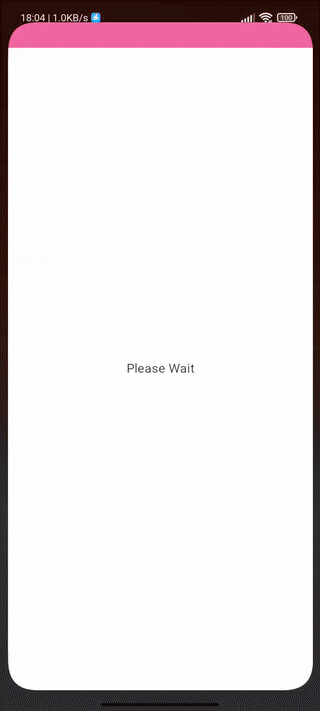

# Users List App

A Sample Application With Jetpack Compose And Clean MVVM Architecture

# Features

- Designed With Jetpack Compose
- Uses MVVM Clean Architecture
- Uses Hilt For Dependency Injection
- Uses Retrofit And Kotlinx Serialization
- Uses Coil For Image Loader
- Uses Compose Navigation
- Modular Design
- Uses Gradle KTS
